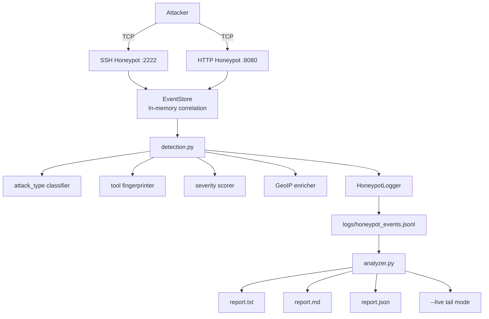

# 🍯 Honeypot v2 — Threat Detection & Analysis System


> **Blue Team / SOC Portfolio — Project 2 (Enhanced)**  
> From a simple listener to a mini threat detection platform.  
> Every attacker interaction is classified, fingerprinted, scored, correlated, and reported.

---

## Architecture



---

## Detection Capabilities

| Capability | Details |
|---|---|
| **attack_type** | `brute_force` · `credential_attempt` · `vuln_scan` · `recon` · `automation_tool` |
| **Tool fingerprinting** | Nuclei, Nikto, sqlmap, WPScan, dirsearch, gobuster, masscan, Metasploit, libssh, Paramiko, Go SSH, python-requests, curl, wget, axios and more |
| **Severity scoring** | CRITICAL / HIGH / MEDIUM / LOW / INFO — based on attack type + tool risk + multi-service flag |
| **Multi-service correlation** | Detects same IP hitting SSH and HTTP — elevated threat level |
| **GeoIP enrichment** | Country, city, ASN, org (optional — requires MaxMind GeoLite2) |
| **Attacker timeline** | Per-IP: first_seen, last_seen, duration, total_attempts |
| **Vulnerability scan detection** | `.env`, `.git/config`, `wp-config.php`, `phpmyadmin`, webshells, and 20+ more paths |
| **SSH tarpitting** | Configurable delay to slow automated scanners |
| **Live tail mode** | Real-time colored event stream from JSONL log |
| **Auto-report bundle** | Generates `.txt` + `.md` + `.json` in one command |

---

## ✨ What's New in v2

- `attack_type` field on every actionable event
- Tool fingerprinting (20+ tool signatures for SSH and HTTP)
- Severity scoring matrix (attack × tool risk × multi-service)
- Multi-service correlation (same IP hitting SSH + HTTP)
- GeoIP / ASN enrichment (optional, graceful fallback)
- Per-IP timeline with `first_seen`, `last_seen`, `duration`, `total_attempts`
- Live tail mode (`--live`) for real-time monitoring
- Auto-report bundle (`--auto-report`) generates all formats at once
- Logs saved as `.jsonl` (industry-standard NDJSON)
- Separated `detection.py` module — clean, testable, reusable

---

## 📁 Project Structure

```
honeypot-v2/
├── honeypot.py          # Honeypot services (SSH + HTTP)
├── detection.py         # Classification, fingerprinting, scoring, GeoIP
├── analyzer.py          # Report generator + live tail
├── logs/
│   └── honeypot_events.jsonl    # NDJSON event log (auto-created)
├── reports/             # Auto-generated report bundles
├── geoip/               # Place MaxMind .mmdb files here (optional)
│   ├── GeoLite2-City.mmdb
│   └── GeoLite2-ASN.mmdb
├── README.md
└── EXPLICACAO_TECNICA_COMPLETA.md
```

---

## 🚀 Quick Start

```bash
git clone https://github.com/youruser/honeypot-v2.git
cd honeypot-v2

# No dependencies required (GeoIP enrichment is optional)
python honeypot.py --verbose

# With GeoIP (after downloading MaxMind databases — see below)
python honeypot.py --verbose \
  --geoip-city geoip/GeoLite2-City.mmdb \
  --geoip-asn  geoip/GeoLite2-ASN.mmdb
```

---

## 🖥️ Honeypot Usage

```
python honeypot.py [options]

  --host          Bind address (default: 0.0.0.0)
  --ssh-port      SSH honeypot port (default: 2222)
  --http-port     HTTP honeypot port (default: 8080)
  --log           JSONL log path (default: logs/honeypot_events.jsonl)
  --delay         SSH tarpit delay in seconds (default: 2)
  --geoip-city    Path to GeoLite2-City.mmdb (optional)
  --geoip-asn     Path to GeoLite2-ASN.mmdb (optional)
  --no-ssh        Disable SSH honeypot
  --no-http       Disable HTTP honeypot
  --verbose       Real-time colored event stream
```

---

## 📊 Analyzer Usage

```bash
# Text report (default)
python analyzer.py logs/honeypot_events.jsonl

# Markdown report
python analyzer.py logs/honeypot_events.jsonl --format markdown --output report.md

# JSON report (for piping into other tools)
python analyzer.py logs/honeypot_events.jsonl --format json --output report.json

# Generate all three formats at once
python analyzer.py logs/honeypot_events.jsonl --auto-report reports/

# Live tail — watch events as they arrive
python analyzer.py logs/honeypot_events.jsonl --live

# Top 20 entries per category
python analyzer.py logs/honeypot_events.jsonl --top 20
```

---

## 📋 Event Schema (JSONL)

Each line is one JSON object. Example:

```json
{
  "timestamp":    "2024-01-10T08:00:02+00:00",
  "service":      "ssh",
  "event_type":   "auth_attempt",
  "src_ip":       "192.168.1.100",
  "src_port":     54321,
  "username":     "root",
  "password":     "123456",
  "client_banner":"SSH-2.0-libssh_0.9.6",
  "attack_type":  "brute_force",
  "severity":     "CRITICAL",
  "multi_service":true,
  "services_seen":["ssh", "http"],
  "tool":         "libssh",
  "tool_category":"bruteforce",
  "tool_risk":    "high",
  "geo": {
    "country":      "Brazil",
    "country_code": "BR",
    "city":         "Sao Paulo",
    "asn":          "AS7162",
    "org":          "Claro",
    "is_private":   false
  }
}
```

---

## 🌍 GeoIP Setup (Optional)

1. Register free at [MaxMind GeoLite2](https://dev.maxmind.com/geoip/geolite2-free-geolocation-data)
2. Download `GeoLite2-City.mmdb` and `GeoLite2-ASN.mmdb`
3. Place in the `geoip/` directory
4. Install the Python client: `pip install geoip2`
5. Run with `--geoip-city geoip/GeoLite2-City.mmdb --geoip-asn geoip/GeoLite2-ASN.mmdb`

The honeypot runs normally without GeoIP — enrichment fields default to `"Unknown"`.

---

## ⚡ Quick Analysis with `jq`

```bash
# All CRITICAL events
jq 'select(.severity == "CRITICAL")' logs/honeypot_events.jsonl

# Top 10 attacker IPs
jq -r '.src_ip' logs/honeypot_events.jsonl | sort | uniq -c | sort -rn | head 10

# All credential pairs tried
jq 'select(.username != "") | {ip: .src_ip, user: .username, pass: .password}' \
   logs/honeypot_events.jsonl

# Multi-service attackers
jq 'select(.multi_service == true) | .src_ip' logs/honeypot_events.jsonl | sort -u

# All tool fingerprints seen
jq -r 'select(.tool) | .tool' logs/honeypot_events.jsonl | sort | uniq -c | sort -rn
```

---

## ⚠️ Ethical & Legal Notice

> Run only on systems and networks you own or have explicit written permission to monitor.  
> Never use captured credentials outside the controlled test environment.  
> Deploying honeypots without authorization may violate laws in your jurisdiction.

---

## 🗺️ Roadmap

- [ ] SMTP honeypot (port 25) — capture spam relay attempts
- [ ] FTP honeypot (port 21) — credential spraying
- [ ] Webhook alerting (Slack / Discord) on first CRITICAL event
- [ ] AbuseIPDB / VirusTotal API lookup per attacker IP
- [ ] SQLite storage for long-term trend analysis
- [ ] Web dashboard (Flask + HTMX) with live event feed

---

## 🔗 Integration with Project 1 — Log Analyzer

```bash
# Honeypot → Log Analyzer pipeline
python honeypot.py --log logs/events.jsonl &
python ../log-analyzer/log_analyzer.py logs/events.jsonl --format markdown
```

---

## 📄 License

MIT — use freely, learn freely.
